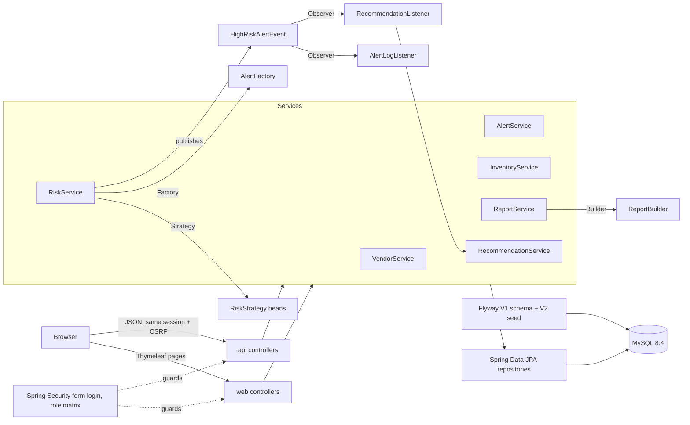

# SentinelSCM

Supply chain disruption and vendor risk management platform. Scores vendors from delivery, defect and compliance data, raises alerts when risk crosses a configurable threshold, recommends safer alternatives, and gives five roles a purpose-built view of the network.

[](https://github.com/Vaibhav2824/SentinelSCM/actions/workflows/ci.yml)
[](https://github.com/Vaibhav2824/SentinelSCM/actions/workflows/cd.yml)
[](https://adoptium.net/)
[](https://spring.io/projects/spring-boot)
[](https://github.com/Vaibhav2824/SentinelSCM/pkgs/container/sentinelscm)
[](LICENSE)

## Run it in one command

```bash
git clone https://github.com/Vaibhav2824/SentinelSCM.git && cd SentinelSCM
cp .env.example .env            # set MYSQL_PASSWORD and MYSQL_ROOT_PASSWORD
docker compose up --build
```

Open <http://localhost:8080> and sign in with any demo account below. To run the published image instead of building:

```bash
docker compose -f docker-compose.yml -f docker-compose.prod.yml up -d
```

| Role | Email | Password | Can do |
|---|---|---|---|
| Administrator | `admin@scm.com` | `admin123` | Everything, including blacklisting, soft-deletes, alert threshold, strategic report |
| Procurement Manager | `pm@scm.com` | `pm123` | Vendor CRUD, suspend/activate, evaluations, alerts, performance report |
| Risk Analyst | `analyst@scm.com` | `analyst123` | Evaluations, risk recalculation, alerts, performance report |
| Warehouse Manager | `wm@scm.com` | `wm123` | Inventory and stock updates |
| Vendor | `vendor@scm.com` | `vendor123` | Read-only vendor list and dashboard |

Suggested walk-through: sign in as the analyst, open **Risk**, pick *ReliableGoods Intl*, drag the sliders to a bad evaluation, save, then **Recalculate**. A HIGH RISK alert appears with three recommended replacements; the vendor flips to `HIGH_RISK`; the dashboard KPIs move. Switch to the admin account to change the threshold or export the strategic CSV.

## Architecture



Single Spring Boot 3.5 / Java 21 deployable. Server-rendered UI (Thymeleaf + Spring Security dialect) and a JSON API under `/api/**` share one session and one role matrix (`security/Access.java`). Flyway owns the schema; the demo dataset is a Java migration so BCrypt hashes are generated at migration time rather than committed.

### Design patterns, and where they live

| Pattern | Where | Why it is there |
|---|---|---|
| Strategy | `service/risk/RiskStrategy`, `WeightedRiskStrategy` | Risk algorithms are beans; `sentinel.risk.strategy` picks the active one and `RiskService.useStrategy` swaps it at runtime |
| Observer | `event/HighRiskAlertEvent` + `@EventListener` beans | `RiskService` publishes; logging and recommendation generation react without being wired into it |
| Factory | `factory/AlertFactory` | One place decides how alerts are worded and graded |
| Builder | `builder/ReportBuilder` -> immutable `Report` record | Fluent assembly; statistics keep insertion order for CSV/JSON |
| Singleton | container-managed beans, HikariCP `DataSource` | The JDBC `Connection` singleton from v1 was not thread-safe; a pool is |
| Template Method / Polymorphism | `domain/user/User` + five subclasses (`SINGLE_TABLE` inheritance) | Each role declares its own permissions and description |
| MVC | `web/` (pages), `api/` (JSON), `service/`, `repository/` | Thin controllers, transactional services, Spring Data repositories |

More detail in [docs/architecture.md](docs/architecture.md).

### Risk model

```
risk = (1 - deliveryTimeliness) * 0.4 + defectRate * 0.4 + (1 - complianceScore) * 0.2
```

| Score | Level | Effect |
|---|---|---|
| 0.0 to 0.4 | LOW | Vendor is `ACTIVE`; eligible as a recommended alternative |
| 0.4 to 0.7 | MEDIUM | Vendor is `ACTIVE`; watch |
| above threshold (default 0.7, admin-editable) | HIGH | Vendor becomes `HIGH_RISK`; alert raised; up to three low-risk alternatives attached |

## JSON API

All endpoints need an authenticated session (log in through `/login`; state-changing calls send the CSRF token from the page `<meta>` tags). Unauthenticated calls get `401`, wrong role gets `403`, every error is a JSON envelope with `status`, `message`, `path` and optional `fieldErrors`.

| Method | Path | Roles |
|---|---|---|
| GET | `/api/vendor` | any |
| GET | `/api/vendor/{id}` | ADMIN, PM, RA, VENDOR |
| POST / PUT | `/api/vendor`, `/api/vendor/{id}` | ADMIN, PM |
| PUT | `/api/vendor/{id}/suspend`, `/activate` | ADMIN, PM |
| PUT | `/api/vendor/{id}/blacklist` · DELETE `/api/vendor/{id}` | ADMIN |
| GET | `/api/vendor/{id}/risk` | ADMIN, PM, RA, VENDOR |
| POST | `/api/vendor/{id}/evaluate` | ADMIN, PM, RA |
| POST | `/api/risk/calculate/{vendorId}` | ADMIN, RA |
| GET / PUT | `/api/risk/config`, `/api/risk/threshold` | any / ADMIN |
| GET | `/api/alert`, `/api/alert/{id}/recommendation` · PUT `/api/alert/{id}/resolve` | ADMIN, PM, RA |
| GET | `/api/inventory` · PUT `/api/inventory/{id}` | ADMIN, PM, WM / ADMIN, WM |
| GET | `/api/report/performance[.csv]` | ADMIN, PM, RA |
| GET | `/api/report/strategic[.csv]` | ADMIN |
| GET | `/api/health`, `/actuator/health` | public |

## Local development

Prerequisites: JDK 21, Docker (for the integration tests), and a MySQL 8 you can reach for running the app outside Compose.

```bash
# run the whole suite: unit tests, Testcontainers-backed integration tests, JaCoCo 80% line-coverage gate
./mvnw verify

# run the app against your own MySQL
export SPRING_DATASOURCE_URL='jdbc:mysql://localhost:3306/scm_db?createDatabaseIfNotExist=true'
export SPRING_DATASOURCE_USERNAME=root SPRING_DATASOURCE_PASSWORD=...
./mvnw spring-boot:run
```

On Windows use `mvnw.cmd`, and quote `-D` flags in PowerShell (`"-Dtest=RiskServiceTest"`). Docker Desktop must be running for the integration tests; `src/test/resources/docker-java.properties` pins the Docker API version so Docker Engine 29+ accepts the client.

Configuration is environment-driven (see `.env.example`): datasource URL/credentials, `SENTINEL_RISK_STRATEGY`, and `SENTINEL_DEMO_SHOW_CREDENTIALS` (turn off in production to hide demo accounts on the login page).

## Testing

| Layer | What | How |
|---|---|---|
| Unit | strategy maths, alert factory, report builder, CSV writer, risk pipeline branches, recommendation ranking | JUnit 5 + Mockito, no Spring context |
| Repository | every derived query against the real schema and seed | `@DataJpaTest` + Testcontainers MySQL 8.4 |
| API | login/logout, 18-row role matrix, vendor CRUD and validation, full evaluate -> alert -> recommendation flow, admin threshold | `@SpringBootTest` + MockMvc |
| Pages | render per role, sidebar derived from role, form validation round-trips, 403/404 templates | MockMvc against Thymeleaf |

One MySQL container is shared by the whole test JVM; each test runs in a rolled-back transaction.

## CI/CD

- **CI** (`.github/workflows/ci.yml`): every push and pull request runs `./mvnw verify` on Ubuntu with Docker available for Testcontainers, and uploads the JaCoCo report. Superseded runs are cancelled.
- **CD** (`.github/workflows/cd.yml`): on `main` and on `v*` tags, reuses the CI job as a gate, then builds the multi-stage image and pushes `ghcr.io/vaibhav2824/sentinelscm` tagged with the commit SHA, `latest` (main) and the semver (tags). Tags also get a GitHub Release with the runnable jar.
- **Dependabot** keeps Maven, Actions and base images current.

The image runs as a non-root user with a health check on `/actuator/health`; Compose waits for MySQL to be healthy before starting the app.

## Project layout

```
src/main/java/com/sentinelscm
├── api/          JSON controllers, DTOs, ApiExceptionHandler
├── web/          Thymeleaf controllers, WebExceptionHandler
├── service/      transactional services, RiskStrategy under service/risk
├── event/        HighRiskAlertEvent + listeners (Observer)
├── factory/      AlertFactory
├── builder/      ReportBuilder, Report
├── domain/       JPA entities and enums; user/ holds the User hierarchy
├── repository/   Spring Data interfaces
├── security/     SecurityUser, UserDetailsServiceImpl, Access (role matrix)
└── config/       SecurityConfig
src/main/java/db/migration     V2__Seed_demo_data (Java migration)
src/main/resources
├── db/migration/V1__schema.sql
├── templates/    layout, login, dashboard, vendors, vendor-form, risk, alerts, alert-detail, inventory, reports, error
└── static/       css/app.css, js/app.js
```

## History

Version 1 was an OOAD course project (Javalin, raw JDBC, static HTML). Version 2 is the Spring Boot rewrite in this branch: same domain and patterns, plus tests, containers and a pipeline. The v1 code is preserved in git history.

## License

MIT, see [LICENSE](LICENSE).
